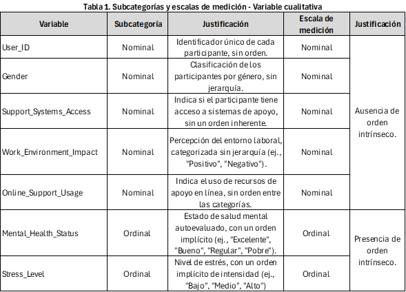
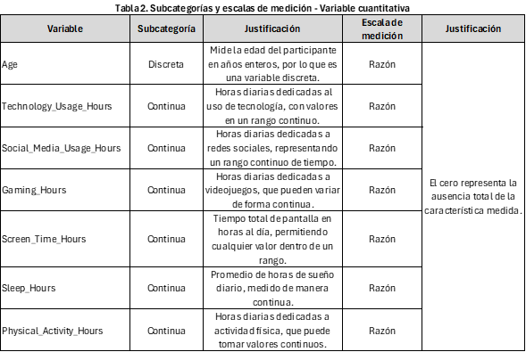

<br>
<div style="text-align: justify">
Sin duda alguna, la delincuencia es una preocupación diaria para los colombianos, pues noticias sobre hurtos y demás actos delictivos están al orden del día, tan solo hay que observar los datos publicados por Probogotá Región en 2023, los cuales mostraron que la extorsión, el hurto a personas, el homicidio, el hurto de automotores y el hurto a residencias son delitos en crecimiento en las diversas regiones del país, lo cual supone un gran desafío para las autoridades y una amplia preocupación para los ciudadanos. Por tanto, analizar una base de datos que comprenda información sobre esta cuestión supone un punto de partida beneficioso que puede llegar a aportar mayor compresión sobre las modalidades de hurto y delincuencia que predominan en el territorio nacional y posibles soluciones para disipar la presente problemática. 
<div/>
<br>
<div style="text-align: justify">
Teniendo en cuenta lo anterior, el objetivo principal de esta pagina web, es realizar un análisis estadístico descriptivo a partir del Dataset **hurtos2.csv**, mediante la realización de tablas de frecuencias, gráficos estadísticos y análisis de asimetría y dispersión que permitan obtener conclusiones coherentes y objetivas con la realidad que exponen los datos. 
<div/>
<br>
```{r setup, include=FALSE}
##Proyecto de estadística 3
##Leer Csv
library(ggplot2)
library(sf)
library(dplyr)
library(readxl)
library(fdth)
library(plotly)
library(qcc)
library(readr)
library(leaflet)
library(htmltools)
library(DT)
library (modeest)
library(moments)
library(explore)
library(lessR)

trabajo <- read_csv("salud_tecnología.csv")
knitr::opts_chunk$set(echo = TRUE)  
```
```{css,echo=FALSE}
.column {display:flex;}
h1{color:rgb(26, 72, 112)}
h2{color:rgb(26, 72, 112)}
```

# 1. Descripción del Dataset

El conjunto de datos se compone de 10,000 filas y 14 columnas, donde cada columna representa una variable relacionada con el uso de tecnología, factores de estilo de vida y aspectos de salud mental de los participantes. Estas 14 columnas corresponden a características bajo estudio que capturan diversos aspectos de cada individuo, permitiendo analizar temas como el tiempo total dedicado a la tecnología, redes sociales y videojuegos, así como el estado de salud mental, los niveles de estrés, las horas de sueño y la actividad física. Además, el conjunto incluye información sobre el acceso a sistemas de apoyo y la percepción del impacto del entorno laboral en la salud mental, proporcionando una base integral para explorar las relaciones entre el uso de tecnología y el bienestar general. A continuación, se presentan las variables:

```{r}
names(trabajo) #Nombre de las columnas y por tanto de las variables
```

Por otro lado, el conjunto de datos cuenta con 10,000 filas, que corresponden al total de observaciones o unidades experimentales en el dataset. Cada fila representa a un participante con datos específicos para cada una de las 14 variables, formando un perfil detallado en términos de uso de tecnología, estilo de vida y salud mental. Con 10,000 unidades experimentales y 14 variables, el dataset contiene un total de 140,000 entradas, lo cual permite un análisis estadístico tanto descriptivo como inferencial sobre los patrones y factores relacionados con el bienestar. En resumen, las dimensiones del conjunto de datos son las siguientes:

```{r}
num_rows <- nrow(trabajo) #Número de observaciones (filas)
num_colums <- ncol(trabajo) #Número de variables (columnas)
total_values <- num_rows*num_colums #Total de datos 

num_rows
num_colums
total_values
```
```{r}
num_rows <- nrow(trabajo) #Número de observaciones (filas)
num_colums <- ncol(trabajo) #Número de variables (columnas)
total_values <- num_rows*num_colums #Total de datos 

num_rows
num_colums
total_values
```

# 1.2 Clasificación de variables

Para realizar un análisis descriptivo adecuado del conjunto de datos seleccionado, es esencial identificar el tipo de variables que contiene. Este dataset abarca información sobre el uso de tecnología, factores de estilo de vida y aspectos de salud mental de los participantes, y comprende tanto variables categóricas como numéricas. La distinción entre estos tipos de variables es fundamental, ya que determina las herramientas y métodos de análisis a emplear: las variables categóricas permiten examinar frecuencias y distribuciones de categorías, mientras que las variables numéricas requieren medidas de tendencia central y dispersión, como la media, mediana y desviación estándar, para describir su comportamiento. Clasificar correctamente las variables facilita la aplicación de técnicas analíticas apropiadas y la obtención de conclusiones válidas y precisas sobre las relaciones entre el uso de tecnología y el bienestar. A continuación, se presenta la clasificación principal de las variables, obtenida mediante la siguiente función:

```{r include=FALSE, paged.print=FALSE}
trabajo_df <- data.frame(trabajo)
```

```{r}
str(trabajo_df) #Visualización de la estructura interna del conjunto de datos
```
como se observa, la función `str()` nos expone 2 tipos de varaibles: `char()` y `num()`, las cuales hacen referencia a las variables cualitativas y cuantitativas respectivamente. Como se observa la clasificación de las varaibles es la siguiente: 

## 1.2.1 Variables Categóricas

Comprenden nombres o etiquetas que indican atributos de algún elemento, además de ser variables que no son cuantificables o con las cuales no se pueden realizar operaciones aritméticas. 
  
  - **User_ID:**: Actúa como una **etiqueta única** para identificar individualmente a cada participante en el estudio, sin implicar un valor cuantitativo o clasificatorio. Su importancia radica en la capacidad de distinguir cada observación de manera anónima, esencial para el seguimiento y análisis individualizado sin comprometer la privacidad. Sin embargo, para el presente análisis el ID no se empleará.
  
  - **Gender**: Representa **categorías de género**, utilizadas para clasificar a los participantes según su identidad de género sin orden numérico. Esta variable es relevante para explorar diferencias en el uso de tecnología y la salud mental entre grupos de género.
  
  - **Mental_Health_Status**: Describe **categorías de estado de salud mental**, evaluadas por cada participante. Esta variable es esencial para comprender el bienestar subjetivo y su posible relación con otros factores como el uso de tecnología y el estilo de vida.
  
  - **Stress_Level**: Refleja **categorías de nivel de estrés**, en las cuales los participantes se autoevalúan. Es clave para analizar cómo diferentes niveles de estrés pueden estar asociados con patrones en el uso de tecnología y hábitos diarios.
  
  - **Support_Systems_Access**: Indica el **acceso a sistemas de apoyo emocional**, categorizado en función de la disponibilidad de redes de apoyo para los participantes. Su relevancia radica en contextualizar el respaldo social y su posible influencia en la resiliencia y salud mental.
  
  - **Work_Environment_Impact**:  Representa la percepción del impacto del entorno laboral sobre el bienestar mental, clasificada en **categorías**. Esta variable es importante para evaluar la influencia de factores externos en el bienestar mental de los participantes.
  
  - **Online_Support_Usage**: Representa el uso de recursos de apoyo en línea, categorizando la preferencia o dependencia de servicios digitales de asistencia. Esta variable es fundamental para analizar el papel del soporte digital en el bienestar mental, permitiendo explorar su influencia en la gestión del estrés y la salud emocional de los participantes.
  
  
## 1.2.2 Variables Cuantitativas

  - **Age**:  Edad del participante en años, una variable cuantificable que mide el tiempo de vida de cada individuo. Su inclusión es fundamental para identificar tendencias en el uso de tecnología y la salud mental que varían con la edad, proporcionando una dimensión demográfica clave en el análisis.
  
  - **Technology_Usage_Hours**: Horas diarias dedicadas al uso de tecnología, una variable cuantitativa que captura el tiempo exacto de exposición tecnológica. Es una medida esencial para estudiar el impacto del tiempo de pantalla en la salud mental y su relación con otros factores de estilo de vida.
  
  - **Social_Media_Usage_Hours**: Horas diarias dedicadas a redes sociales, cuantificables y expresadas en unidades de tiempo. Permite analizar de manera precisa cómo el tiempo en redes sociales afecta el estrés y la salud mental de los participantes.
  
  - **Gaming_Hours**: Horas diarias dedicadas a videojuegos, cuantificadas para reflejar el tiempo exacto invertido en esta actividad. Esta medida permite evaluar si el tiempo de juego se correlaciona con otros aspectos del bienestar mental y social.
  
   - **Screen_Time_Hours**: Tiempo total de pantalla al día, medido en horas y cuantificado para reflejar la exposición total a dispositivos digitales. Es relevante para analizar cómo la exposición prolongada a pantallas puede influir en la salud mental y el bienestar general.
  
  - **Sleep_Hours**: Promedio de horas de sueño diario, cuantificable en unidades de tiempo. Es crucial para entender la relación entre un descanso adecuado, el estrés y el bienestar general de los participantes.
  
  - **Physical_Activity_Hours**: Horas diarias dedicadas a actividad física, una medida cuantitativa que cuantifica el nivel de actividad física. Es clave en estudios de salud mental y bienestar, ya que la actividad física se relaciona con la reducción del estrés y el fortalecimiento del bienestar general.
  
  
# 1.3  Subclasificación de variables y escalas de medición
<div style="text-align: justify">
Si bien las variables se clasifican principalmente en cualitativas y cuantitativas, estás también se pueden dividir en subcategorías dependiendo si son numéricas o categóricas y, además, pueden adaptar diversas escalas de medición. A continuación, se presentan 2 tablas que resumen esta información. 
<div/>

## 1.3.1 Variables Categóricas

<center>
 {width=700}

</center>
<br>
<div style="text-align: justify"> 
Las variables categóricas en este conjunto de datos se dividen en nominales y ordinales, cada una con su respectiva relevancia en el análisis de bienestar y uso de tecnología. Las variables nominales, que incluyen User_ID, Gender, Support_Systems_Access, Work_Environment_Impact, y Online_Support_Usage, permiten clasificar a los participantes en categorías sin un orden jerárquico. Esto es fundamental para identificar patrones de pertenencia y realizar análisis de frecuencia, facilitando una comprensión de características como el acceso a sistemas de apoyo o el impacto percibido del entorno laboral sin asumir una progresión entre las categorías.
<div/>
<br>
Por otro lado, las variables ordinales, como Mental_Health_Status y Stress_Level, poseen un orden implícito que permite jerarquizar los estados de salud mental y niveles de estrés. Aunque no se cuantifica la distancia exacta entre cada categoría, este orden facilita el análisis de tendencias en el bienestar percibido y el estrés, proporcionando una visión de cómo estas variables se relacionan con el uso de tecnología y otros factores de estilo de vida. Esta clasificación entre nominales y ordinales es esencial para aplicar métodos estadísticos adecuados a cada tipo de variable y obtener resultados significativos en el análisis del conjunto de datos.
<div/>
<br>

## 1.3.2 Variables Cuantitativas
<center>
 {width=700}

</center>
<br>
<div style="text-align: justify"> 
Las variables cuantitativas en este conjunto de datos se dividen en continuas y discretas, cada una con una escala de medición adecuada para el análisis. La única variable discreta es Age, medida en años enteros y clasificada en una escala de razón, ya que cuenta con un cero absoluto que representa la ausencia de tiempo de vida. Esto permite comparaciones proporcionales, como afirmar que alguien de 30 años tiene el doble de edad que alguien de 15 años, lo cual es útil en el análisis demográfico y en la identificación de patrones de edad en el uso de tecnología y bienestar.
<div/>
<br>
Las demás variables cuantitativas Technology_Usage_Hours, Social_Media_Usage_Hours, Gaming_Hours, Screen_Time_Hours, Sleep_Hours y Physical_Activity_Hours— son continuas. Estas variables se miden en una escala de razón con un cero absoluto, que representa la ausencia total de la actividad medida (por ejemplo, cero horas de uso de tecnología o de sueño). Esto permite operaciones aritméticas y análisis detallados, como el cálculo de promedios, variaciones y proporciones, para estudiar la relación entre el uso de tecnología, el tiempo dedicado a actividades específicas y su impacto en el bienestar general.
<div/>
<br>


